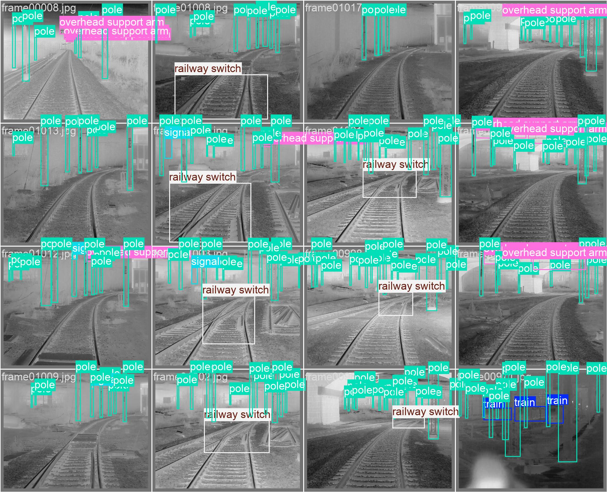
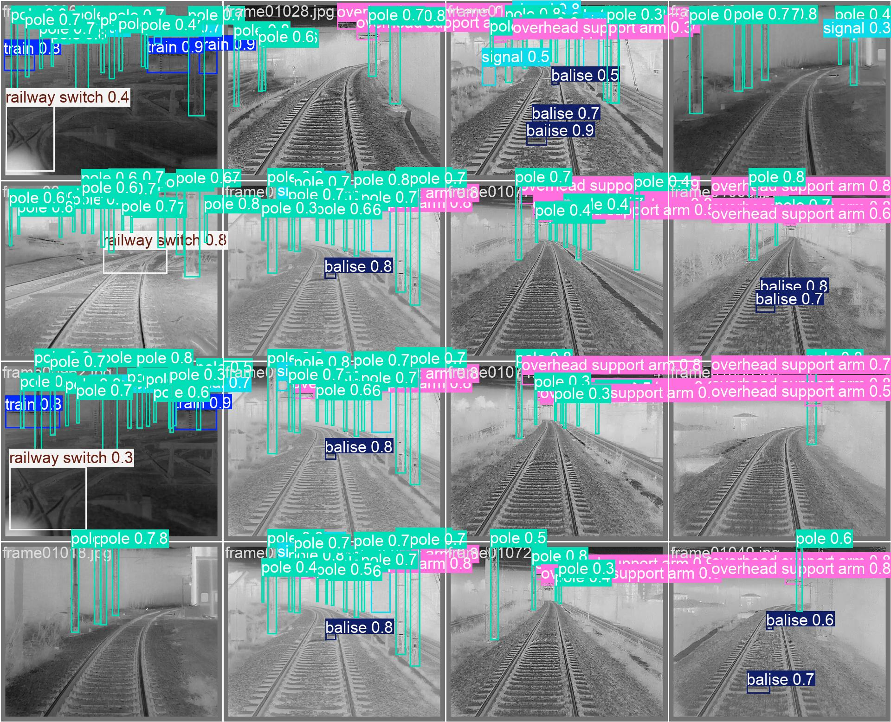

# YOLOv12n Thermal Video Detector

This repository contains a **YOLOv12n** model fine-tuned for **object detection in railway thermal videos**.  
The model has been trained to recognize railway infrastructure elements in thermal conditions (LWIR/MWIR), with a focus on speed and real-time inference.

The chosen variant is the **nano (n)**, optimized to ensure maximum performance even on lightweight GPUs, such as those available on Google Colab.

---

## 🚀 Try It Now (with GPU)

You can test the model in real time using the interactive notebook on Google Colab:

[](LINK_TO_YOUR_COLAB)

Within the notebook you can:
- Automatically load the model
- Upload your own thermal video
- Run inference with GPU acceleration
- View the result directly in your browser

---

## 🧠 Classes Detected by the Model

The YOLOv12n model is trained to recognize the following thermal classes related to the railway domain:

- **train**
- **signal**
- **railway switch**
- **pole**
- **balise**
- **overhead support arm**

---

## 📂 Project Structure

```
yolov12n-thermal-video-detector/
│
├── README.md
├── requirements.txt
├── .gitignore
│
├── weights/
│   └── best.pt 
│
├── src/
│   ├── video_inference.py
│   ├── thermal_preprocess.py
│   ├── utils.py
│   ├── model_loader.py
│   └── __init__.py
│
├── notebooks/
│   └── thermal_video_colab.ipynb
│
├── images/
│   ├── training_curve.png
│   ├── example_thermal1.png
│   └── example_thermal2.png
│
├── datasets/
│   └── dataset_info.md
│
├── outputs/
│   └── .gitkeep
│
└── scripts/
    └── download_weights.py
```

---

## 🧩 Local Installation

> ⚠️ Real-time inference on CPU may not be smooth.  
> For the best experience, use the Colab demo.

```bash
git clone https://github.com/.../yolov12n-thermal-video-detector.git
cd yolov12n-thermal-video-detector
pip install -r requirements.txt
```

---

## 🔹 Download the Weights

Download the `best.pt` file from:

➡️ [Download weights](https://drive.google.com/uc?export=download&id=1V6x8ROG5AGGCQ5PUdtZkr4UnbfXqBrZb)

---


## 📊 Model Results

| Metric        | Value |
|---------------|-------|
| mAP50         | 0.XX  |
| mAP50-95      | 0.XX  |
| Precision     | 0.XX  |
| Recall        | 0.XX  |
| FPS (Colab T4)| XX    |

---

## 📉 Training Progress


---

## 🔥 Thermal Inference Examples

<p align="center">
  
  
</p>

---

## ⚠️ Model Limitations

- Very small objects may be difficult to detect
- A GPU is required for high FPS

---

## 🤝 Contributing

Pull requests and contributions are welcome!  
If you use this model in a real project, let me know: I’m always happy to see real-world applications.

---

## 📄 License

MIT License