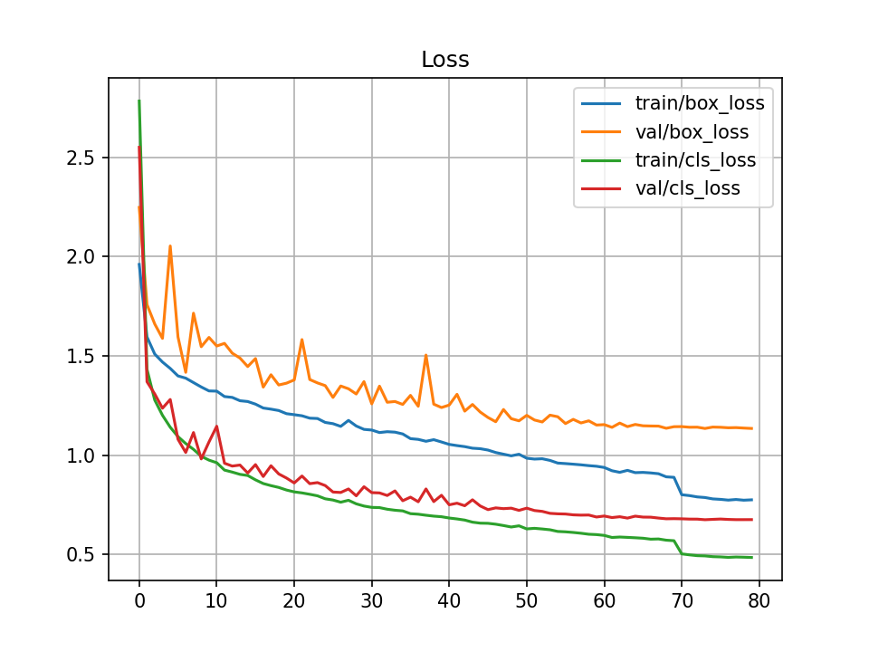
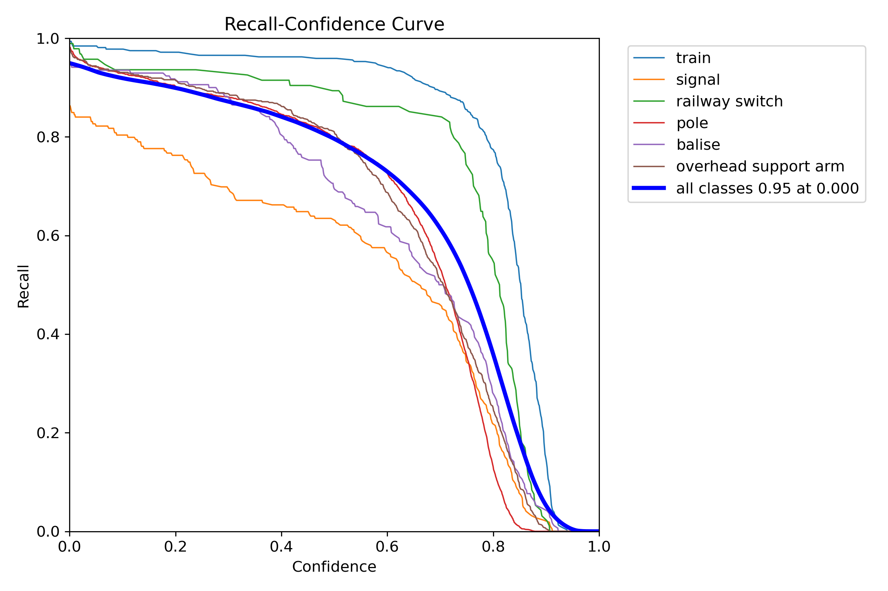
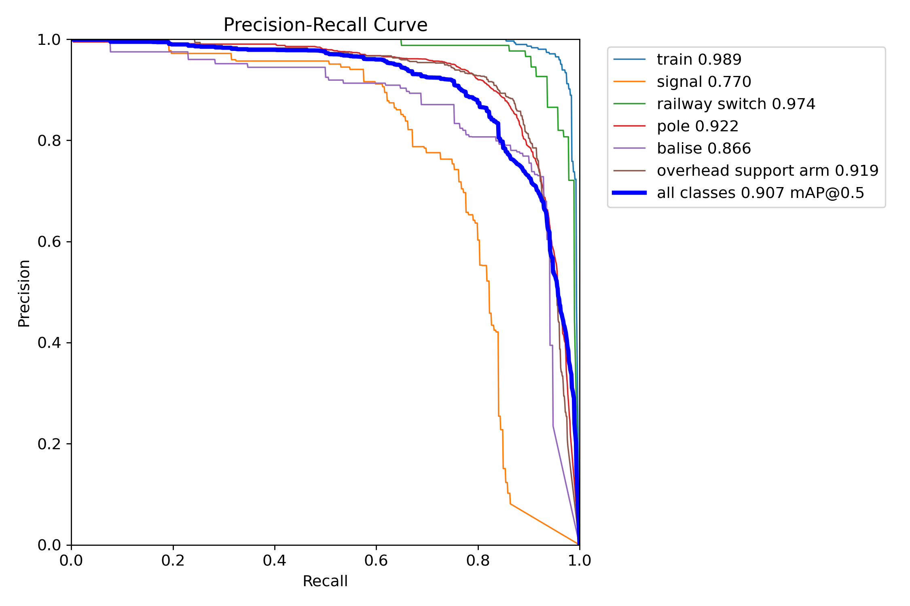
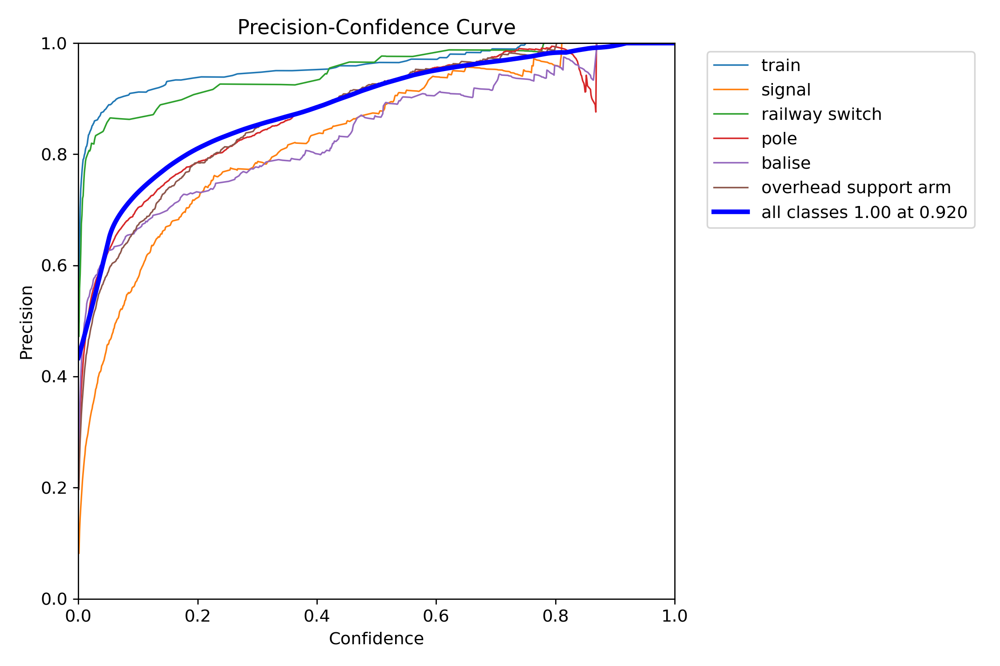
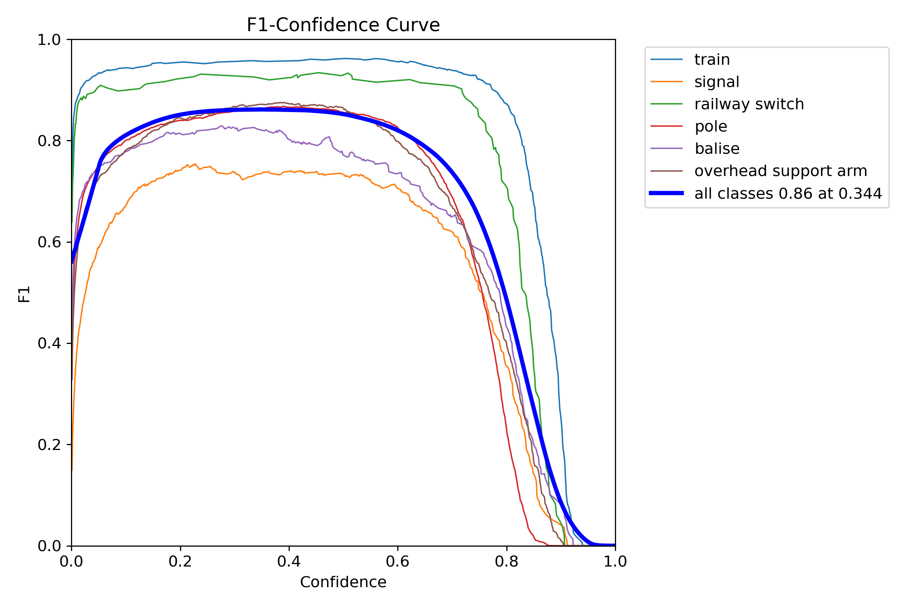
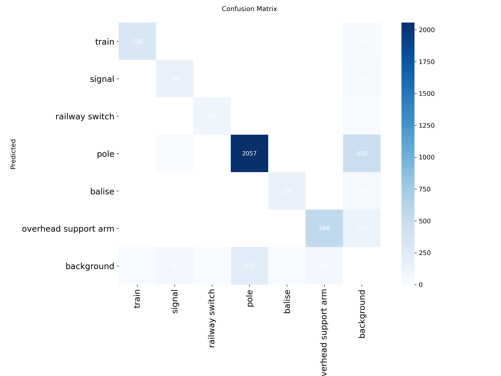
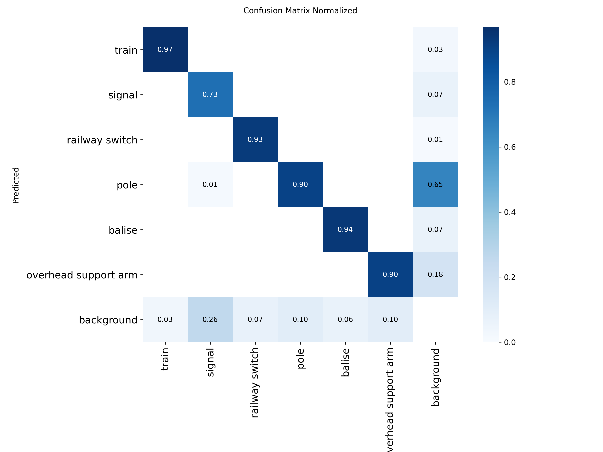

# YOLOv12n Thermal Video Detector

This repository contains a **YOLOv12n** model fine-tuned for **object detection in railway thermal videos**.  
The model has been trained to recognize railway infrastructure elements in thermal conditions.

The chosen variant is the **nano (n)**, optimized to ensure maximum performance even on lightweight GPUs, such as those available on Google Colab.

---

## 🚀 Try It Now (with GPU)

You can test the model in real time using the interactive notebook on Google Colab:

[](
https://colab.research.google.com/github/Simone2408/yolov12n-thermal-video-detector/blob/main/notebooks/yolov12n_thermal_demo.ipynb
)


Within the notebook you can:
- Automatically load the model
- Upload your own thermal video
- Run inference with GPU acceleration
- View the output result 

---

## 🧠 Classes Detected by the Model

The YOLOv12n model is trained to recognize the following thermal classes related to the railway domain:

- **train**
- **signal**
- **railway switch**
- **pole**
- **balise**
- **overhead support arm**


---

## 📂 Project Structure

```
yolov12n-thermal-video-detector/
│
├── README.md
├── requirements.txt
├── .gitignore
│
├── weights/
│   └── best.pt 
│
├── src/
│   ├── video_inference.py
│   ├── utils.py
│   └── __init__.py
│
├── notebooks/
│   └── yolov12n_thermal_demo.ipynb
│
├── images/
│   ├── loss.png
│   ├── example_thermal1.jpg
│   └── example_thermal2.jpg
│
├── outputs/
│   └── .gitkeep

```

---

## 🧩 Local Installation

> ⚠️ Real-time inference on CPU may not be smooth.  
> For the best experience, use the Colab demo.

### 🔒 (Recommended) Create and Activate a Virtual Environment

---

It's highly recommended to use a virtual environment to isolate project dependencies.

#### 1. Create the Environment

```bash
python3 -m venv venv
```
2. Activate the Environment
macOS / Linux

```bash

source venv/bin/activate
```
Windows

```bash

venv\Scripts\activate
```
3. Clone Repository and Install Dependencies
```bash

git clone https://github.com/Simone2408/yolov12n-thermal-video-detector.git
```
```bash

cd yolov12n-thermal-video-detector
```
```bash

pip install -r requirements.txt
```
## 🔹 Download the Weights

Download the `best.pt` file from:

➡️ [Download weights](https://drive.google.com/uc?export=download&id=1V6x8ROG5AGGCQ5PUdtZkr4UnbfXqBrZb)

---


## 📊 Model Results & Training Analysis

All metrics are computed on the validation set at the final epoch (80).

### **📌 Summary Metrics**

| Metric            | Value   |
|-------------------|---------|
| **mAP@0.5**       | **0.905** |
| **mAP@0.5:0.95**  | **0.552** |
| **Precision**     | **0.898** |
| **Recall**        | **0.840** |

---

## 📉 Training Progress

<p align="center">
  
</p>

This plot shows how both **training loss** and **validation loss** evolve during training.

### **🔎 Axis Meaning**
- **X-axis — Epochs:**  
  One value per training epoch.

- **Y-axis — Loss value:**  
  Lower values indicate that the model is learning effectively.

A stable downward trend indicates healthy convergence.

---

## 📈 Detailed Evaluation Curves

These curves help visualize the model’s behavior under different confidence thresholds.

### **🔵 Recall–Confidence Curve**
<p align="center">
  
</p>

Shows how recall decreases as confidence increases.

---

### **🟢 Precision–Recall Curve**
<p align="center">
  
</p>

Displays the tradeoff between precision and recall for each class.

---

### **🟡 Precision–Confidence Curve**
<p align="center">
  
</p>

Illustrates how precision varies with different confidence thresholds.

---

### **🟣 F1–Confidence Curve**
<p align="center">
  
</p>

Shows the harmonic mean of precision and recall across confidence values.

---

## 🧩 Confusion Matrices

### **Confusion Matrix (Absolute Values)**
<p align="center">
  
</p>

---

### **Confusion Matrix (Normalized)**
<p align="center">
  
</p>

Normalized values (0–1) allow direct comparison between classes.

---


## 🔥 Thermal Inference Examples

<p align="center">
  
  
</p>

---

## ⚠️ Model Limitations

- Very small objects may be difficult to detect
- A GPU is required for high FPS

---

## 🤝 Contributing

Pull requests and contributions are welcome!  
If you use this model in a real project, let me know: I’m always happy to see real-world applications.

---

## 📄 License

MIT License